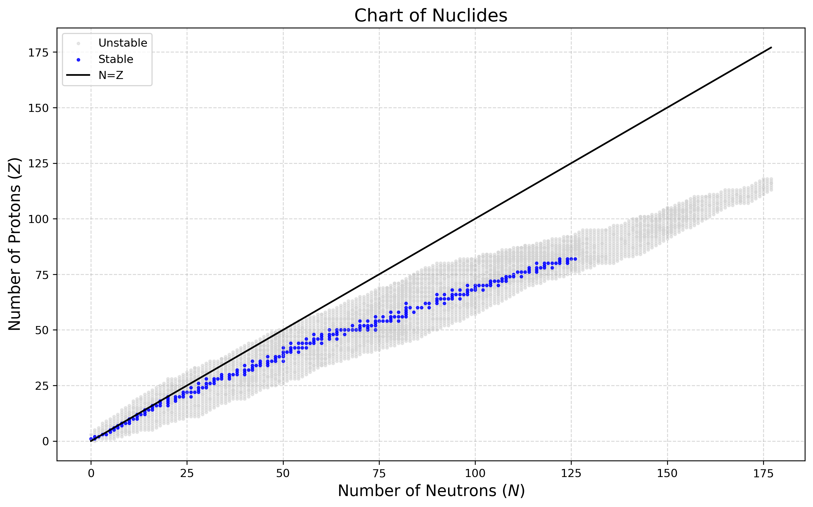
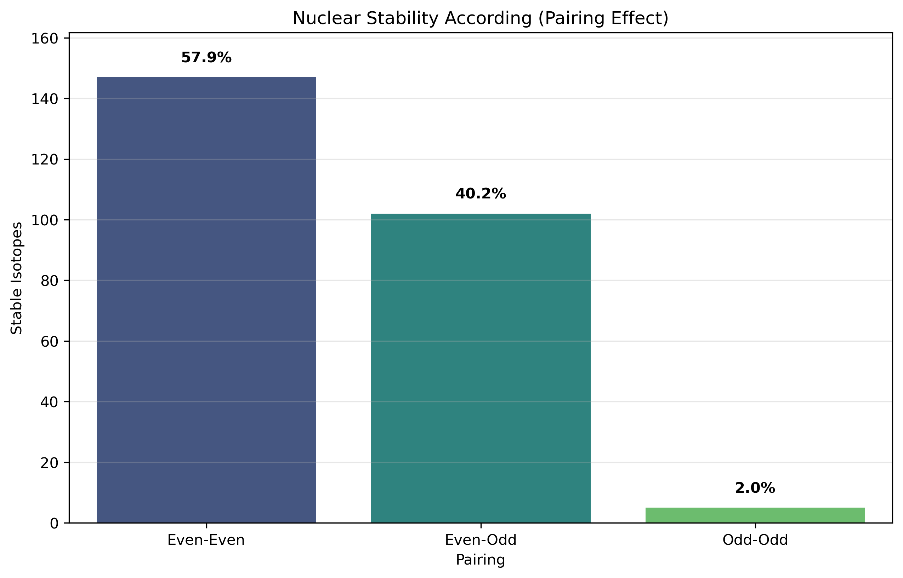
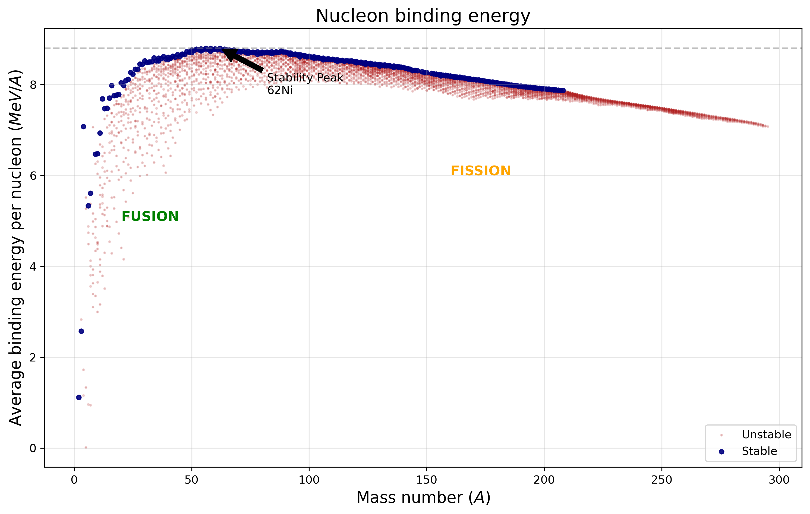
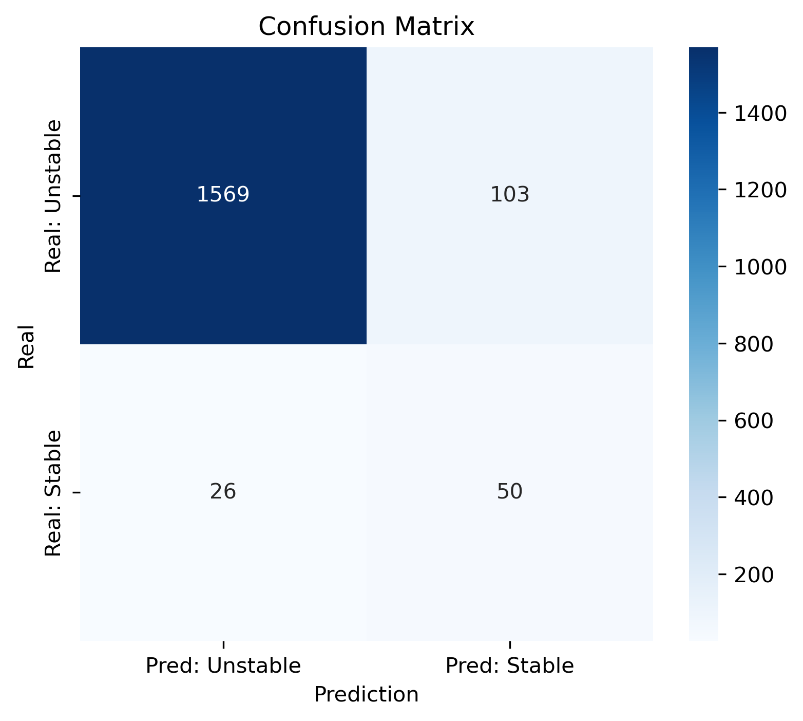
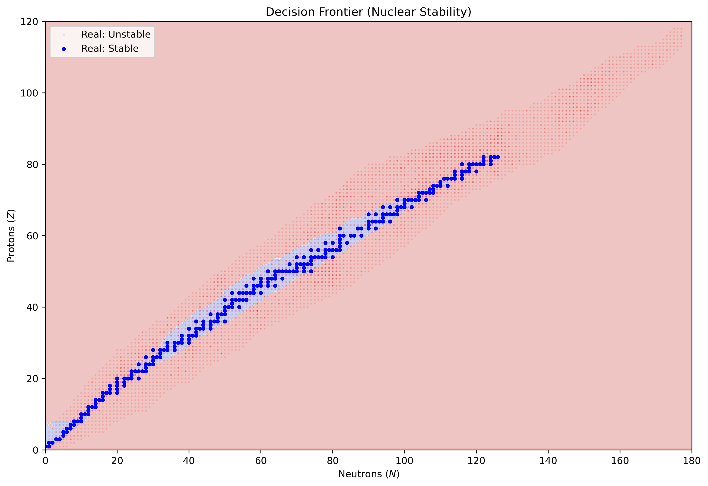
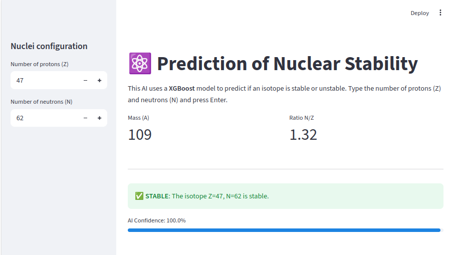

# ⚛️ AI-Powered Nuclear Stability Predictor


## 📌 Project Overview
This project applies **Machine Learning (XGBoost)** to solve a fundamental problem in Nuclear Physics: predicting atomic stability based solely on the number of protons ($Z$) and neutrons ($N$).

Using data from the **IAEA NUBASE2020** evaluation, the model reconstructs the "Valley of Stability" without explicit programming of physical laws, demonstrating how AI can rediscover physical constraints like **Coulomb Repulsion** and the **Pauli Exclusion Principle**.

### 🎯 Key Objectives
1.  **Handle Extreme Imbalance:** Stable isotopes represent only **4.35%** of known nuclei.
2.  **Physical Interpretability:** Bridge the gap between "Black Box" models and Nuclear Theory (Liquid Drop Model).
3.  **Industry Metrics:** Evaluate performance using **Lift** to demonstrate search efficiency in rare-event detection.

---

## 🔬 Data Analysis & Physics Background
Before training, we analyzed the raw experimental data to understand the quantum mechanical drivers of stability.

### 1. The Raw Data (Chart of Nuclides)
Visualizing the 5,000+ isotopes reveals the "Valley of Stability" deviating from the $N=Z$ line due to Coulomb repulsion.



### 2. Quantum Pairing Effect
Why are some combinations more stable? Our analysis confirms the **Pairing Term** ($\delta$) from the Semi-Empirical Mass Formula. Even-Even nuclei (paired spins) are significantly more stable than Odd-Odd configurations. This is a consequence of the nuclear interaction favoring the formation of $J=0$ coupled pairs within the valence shells of the Nuclear Shell Model. 



### 3. Reconstructing Binding Energy
By analyzing the predicted stability and mass excess, we reconstructed the **Binding Energy per Nucleon** curve. The model correctly identifies the **Iron-Nickel Peak ($^{62}Ni$)** as the most stable configuration, distinguishing between Fusion and Fission domains and remarking the importance of this feature to identify stable nuclei. 



---

## 📊 Model Performance & Visualization

### 1. Confusion Matrix Analysis
* **Accuracy:** 92.6% (Correctly classifies the vast majority of unstable isotopes).
* **Recall (Sensitivity):** 66% (Successfully identifies 2 out of 3 stable isotopes).
* **False Positives (103):** The model identifies 103 unstable isotopes as stable. Physically, these likely correspond to **long-lived metastable states** that sit on the "Drip Lines" and share structural properties with stable nuclei.



### 2. The "Lift" Metric (Search Efficiency)
Searching for stable isotopes randomly is inefficient (finding a needle in a haystack).
* **Random Baseline:** 4.35% chance of finding a stable nucleus.
* **Model Precision:** 32.7% chance when using the AI.

$$\text{Lift} = \frac{32.7\%}{4.35\%} \approx 7.5\times$$

### 3. The AI-Generated Decision Boundary
The XGBoost model learned a decision boundary (blue zone) that closely matches experimental stable isotopes (blue dots). Note the "jagged" edges, a geometric characteristic of the orthogonal splits in tree-based algorithms.



### 4. Interactive Deployment (Web App)
To demonstrate the model's practical utility, a user-friendly web interface was developed. This application allows users to query specific nuclear configurations and receive real-time predictions without writing code.

* **Real-Time Inference:** The app loads the trained XGBoost model (`.pkl`) to classify isotopes instantly.
* **Automatic Feature Engineering:** Users only input Proton ($Z$) and Neutron ($N$) numbers; the app automatically calculates derived features like Mass Number ($A$) and the $N/Z$ Ratio before feeding them to the model.
* **Confidence Scoring:** It provides a probability score (0-100%), offering transparency on the model's certainty regarding the prediction for both stable and unstable nuclei. 


*Figure: The interface correctly predicting the stability of Silver-109 ($Z=47, N=62$) with high confidence.*

🚀 **Conclusion:** Using this model makes the identification of stable/metastable candidates **7.5 times more effective** than random experimentation. This metric is crucial for industrial applications like mineral exploration or anomaly detection.

---

## ⚛️ Feature Importance vs. Liquid Drop Model

The model independently identified the hierarchy of forces governing **stability limits**.

While the Liquid Drop Model's **Volume Term ($a_1 A$)** contributes the most to the *total energy*, the Machine Learning model correctly identified that the **decision to be stable or unstable** is driven by the destabilizing terms (Coulomb and Asymmetry).


| Feature | Importance | Physical Interpretation |
| :--- | :--- | :--- |
| **$Z$ (Protons)** | **38%** | **Destabilizing Force (Coulomb):** Corresponds to the $a_c$ term. The model learned that high proton density breaks the nucleus, overriding the strong force. |
| **$N/Z$ Ratio** | **32%** | **Symmetry Penalty (Asymmetry):** Corresponds to the $a_a$ term. Deviations from the optimal ratio drastically reduce the probability of stability. |
| **$A$ (Mass)** | **<10%** | **Volume Term:** Although dominant in energy magnitude, simple size ($A$) is a poor *discriminator* for stability compared to charge/symmetry balance. |

---

## 🛠️ Methodology & Tech Stack

* **Data Source:** IAEA NUBASE2020 (Parsed from raw ASCII).
* **Preprocessing:** Feature Engineering ($N/Z$ Ratio, N, A, Z), SMOTE for balancing classes (from 4% to 50%).
* **Model:** **XGBoost Classifier** (Gradient Boosting).
* **Validation:** Stratified Train-Test Split (70/30).

---

## 💻 How to Run Locally

1.  **Clone the repository:**
    ```bash
    git clone [https://github.com/diegofranco2410/nuclear_stability.git](https://github.com/diegofranco1410/nuclear_stability.git)
    cd nuclear_stability
    ```

2.  **Install dependencies:**
    ```bash
    pip install -r requirements.txt
    ```

3.  **Run the Streamlit App:**
    ```bash
    streamlit run app.py
    ```

---

## 📜 License
This project is open-source under the MIT License.

## 📬 Contact
Created by **Diego Franco** - B.Sc. Physics Candidate & Data Science Practitioner.
[LinkedIn](https://www.linkedin.com/in/diegofranco2410/) | [Email](mailto:diegofranco2410@gmail.com)
